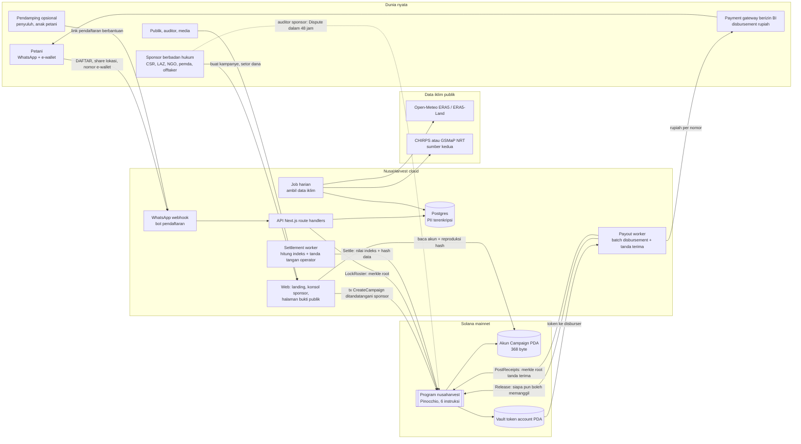
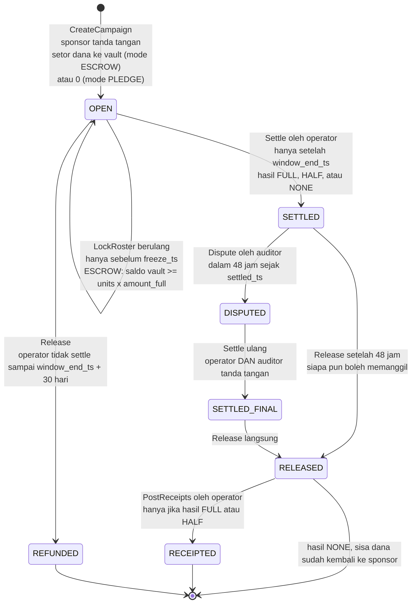
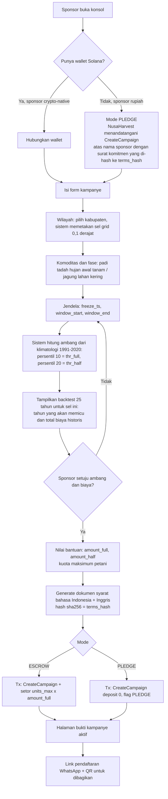
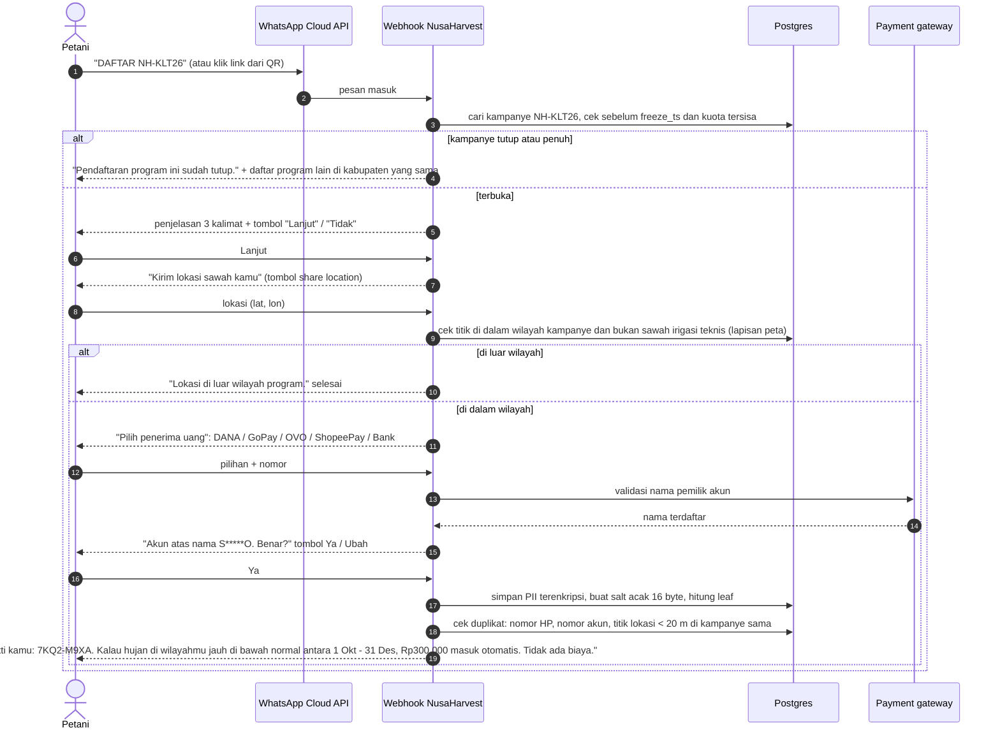
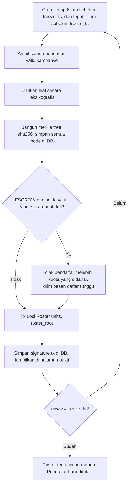
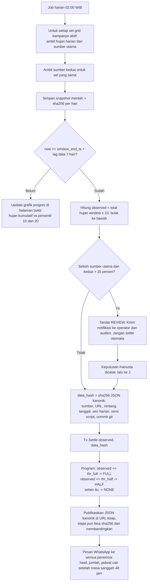
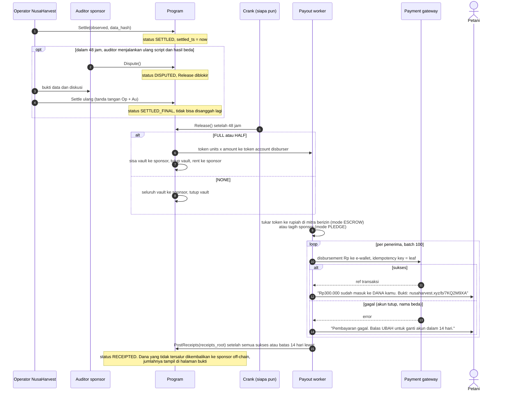
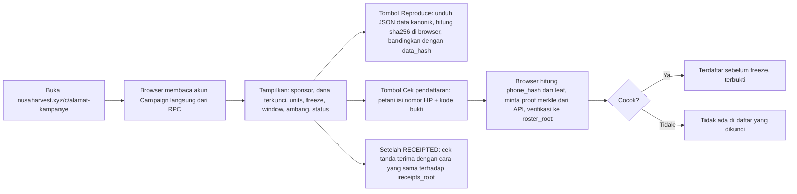

# NusaHarvest V2: Flowchart dan Skema Final

Dokumen ini adalah spesifikasi yang dikunci untuk build. Perubahan pada bagian 3 (skema on-chain) wajib menaikkan `RULE_VERSION` dan dicatat di changelog, karena kampanye lama merujuk versi aturan yang dipakai saat dibuat.

Diagram memakai Mermaid (tampil di GitHub, VS Code dengan ekstensi Mermaid, dan Artifact).

---

## 1. Peta sistem



Aturan desain yang tidak boleh dilanggar:
1. Petani tidak pernah menandatangani transaksi dan tidak pernah memegang token.
2. Tidak ada PII di chain. Hanya hash bergaram.
3. Tidak ada data simulasi di build produksi. Replay historis hanya boleh tampil dengan label "Historical replay" dan hanya di cluster terpisah.
4. Program tidak menyimpan daftar penerima per akun (hemat rent). Satu kampanye = satu akun 368 byte + satu token account.

---

## 2. Flowchart detail

### 2.1 Siklus hidup kampanye (state machine on-chain)



### 2.2 Pembuatan kampanye oleh sponsor



Batas jujur mode PLEDGE: chain membuktikan daftar penerima, hasil trigger, dan tanda terima, tetapi **tidak** membuktikan dana tersedia. Halaman bukti wajib menampilkan label "Dana tidak dikunci on-chain" untuk kampanye PLEDGE.

### 2.3 Pendaftaran petani lewat WhatsApp



### 2.4 Kunci daftar penerima



Rumus leaf (versi aturan 1):
```
phone_hash   = sha256( salt_16 || e164_phone_utf8 )
leaf         = sha256( "NH1" || campaign_pubkey_32 || phone_hash_32 || plot_cell_u32_le )
node         = sha256( min(a,b) || max(a,b) )          // pasangan terurut, tanpa indeks posisi
receipt_leaf = sha256( "NHR1" || leaf_32 || amount_u64_le || gateway_ref_hash_32 || paid_ts_i64_le )
```

### 2.5 Pipeline data iklim dan settle



### 2.6 Sanggahan, rilis dana, dan penyaluran rupiah



### 2.7 Verifikasi oleh publik dan oleh petani



Catatan: proof merkle diberikan API, tetapi verifikasi terjadi di browser terhadap root yang dibaca langsung dari chain. API yang berbohong tidak bisa membuat proof yang cocok.

---

## 3. Skema on-chain (RULE_VERSION = 1)

### 3.1 Akun

**Campaign** (PDA, seeds `["camp", sponsor, campaign_id_le8]`), 360 byte, little-endian, tanpa padding implisit.

| Offset | Ukuran | Field | Tipe | Keterangan |
|---|---|---|---|---|
| 0 | 1 | tag | u8 | selalu 1 |
| 1 | 1 | bump | u8 | bump PDA campaign |
| 2 | 1 | status | u8 | 0 OPEN, 1 SETTLED, 2 DISPUTED, 3 SETTLED_FINAL, 4 RELEASED, 5 RECEIPTED, 6 REFUNDED |
| 3 | 1 | flags | u8 | bit0 PLEDGE, bit1..2 hasil (0 NONE, 1 HALF, 2 FULL) |
| 4 | 1 | vault_bump | u8 | bump PDA vault |
| 5 | 1 | rule_version | u8 | 1 |
| 6 | 2 | reserved | [u8;2] | nol |
| 8 | 4 | units | u32 | jumlah penerima di roster terakhir |
| 12 | 4 | reserved2 | [u8;4] | nol |
| 16 | 8 | campaign_id | u64 | |
| 24 | 32 | sponsor | Pubkey | penerima sisa dana dan rent |
| 56 | 32 | operator | Pubkey | LockRoster, Settle, PostReceipts |
| 88 | 32 | auditor | Pubkey | Dispute, co-sign Settle ulang |
| 120 | 32 | disburser | Pubkey | owner token account penerima rilis |
| 152 | 32 | mint | Pubkey | USDC atau stablecoin rupiah yang diverifikasi alamatnya |
| 184 | 8 | freeze_ts | i64 | batas LockRoster |
| 192 | 8 | window_end_ts | i64 | Settle hanya setelah ini |
| 200 | 8 | settled_ts | i64 | awal masa sanggah |
| 208 | 8 | amount_full | u64 | per penerima, base unit token |
| 216 | 8 | amount_half | u64 | |
| 224 | 4 | thr_full | i32 | mm x 10 |
| 228 | 4 | thr_half | i32 | mm x 10 |
| 232 | 4 | observed | i32 | mm x 10 |
| 236 | 4 | reserved3 | [u8;4] | nol |
| 240 | 32 | terms_hash | [u8;32] | sha256 dokumen syarat + sel grid + sumber data + commit script |
| 272 | 32 | roster_root | [u8;32] | |
| 304 | 32 | data_hash | [u8;32] | |
| 336 | 32 | receipts_root | [u8;32] | |

Total **368 byte**. Pakai `CAMPAIGN_LEN = 368` di kode dan uji dengan `assert!(size_of::<Campaign>() == 368)`. Rent: (368 + 128) x 6.960 lamport = 3.452.160 lamport = **0,00345 SOL** per kampanye, dibayar sponsor, permanen sebagai arsip.

**Vault** (PDA token account, seeds `["vault", campaign]`), 165 byte SPL Token. Rent 0,00204 SOL, dikembalikan ke sponsor saat Release menutup vault.

### 3.2 Instruksi (tag 1 byte, data fixed-size)

| Tag | Nama | Penanda tangan | Akun (urutan) | Data | Aturan |
|---|---|---|---|---|---|
| 0 | CreateCampaign | sponsor (payer) | sponsor, campaign PDA (w), vault PDA (w), mint, sponsor_token (w), system_program, token_program, rent tidak dipakai (pakai sysvar via syscall) | campaign_id u64, operator 32, auditor 32, disburser 32, freeze_ts i64, window_end_ts i64, amount_full u64, amount_half u64, thr_full i32, thr_half i32, terms_hash 32, deposit u64, pledge u8 | now < freeze_ts < window_end_ts; thr_full <= thr_half; amount_half <= amount_full; amount_full > 0; pledge = 1 berarti deposit = 0; buat akun PDA dan vault; transfer deposit |
| 1 | LockRoster | operator | operator, campaign (w), vault | units u32, roster_root 32 | status OPEN; now < freeze_ts; units > 0; jika bukan PLEDGE: saldo vault >= units x amount_full (cek overflow) |
| 2 | Settle | operator (+ auditor jika DISPUTED) | operator, campaign (w), [auditor] | observed i32, data_hash 32 | now >= window_end_ts; units > 0; status OPEN, atau DISPUTED dengan dua tanda tangan; set hasil, settled_ts; status SETTLED atau SETTLED_FINAL |
| 3 | Dispute | auditor | auditor, campaign (w) | kosong | status SETTLED; now < settled_ts + 172.800 |
| 4 | Release | siapa pun | campaign (w), vault (w), disburser_token (w), sponsor_token (w), sponsor (w, penerima rent), token_program | kosong | (status SETTLED dan now >= settled_ts + 172.800) atau SETTLED_FINAL: bayar sesuai hasil, sisa ke sponsor, tutup vault, status RELEASED. Atau status OPEN dan now >= window_end_ts + 2.592.000: semua ke sponsor, status REFUNDED. Validasi owner dan mint kedua token account. PLEDGE: tidak ada transfer, hanya ubah status |
| 5 | PostReceipts | operator | operator, campaign (w) | receipts_root 32 | status RELEASED; hasil FULL atau HALF; status RECEIPTED |

Kode error (u32): 1 InvalidTag, 2 InvalidData, 3 MissingSigner, 4 BadPda, 5 BadOwner, 6 BadMint, 7 WrongStatus, 8 TooEarly, 9 TooLate, 10 Underfunded, 11 Overflow, 12 BadParams.

Keputusan penghematan ukuran binary:
- Tanpa Anchor, tanpa Borsh, tanpa `std`, tanpa allocator. Parsing data dengan slice dan `from_le_bytes`.
- Tanpa verifikasi merkle on-chain. Petani tidak klaim on-chain, jadi program tidak butuh sha256.
- Tanpa logging string di build rilis (pakai kode error saja).
- Satu program, bukan tiga.

---

## 4. Skema off-chain

### 4.1 Postgres

```sql
create table sponsors (
  id uuid primary key, legal_name text not null, kind text not null check (kind in ('csr','laz','ngo','pemda','offtaker','team')),
  wallet text, contact_email_enc bytea, created_at timestamptz default now()
);
create table campaigns (
  id uuid primary key, sponsor_id uuid references sponsors, code text unique not null,      -- NH-KLT26
  pubkey text unique, campaign_id bigint not null, mode text check (mode in ('escrow','pledge')),
  grid_cells int[] not null, commodity text not null, freeze_ts timestamptz, window_start date, window_end date,
  thr_full_mm10 int, thr_half_mm10 int, amount_full_idr int, amount_half_idr int, units_max int,
  terms_doc_url text, terms_hash text, rule_version smallint default 1, status text, created_tx text
);
create table enrollments (
  id uuid primary key, campaign_id uuid references campaigns, phone_enc bytea not null, phone_lookup_hmac text not null,
  payout_channel text, payout_account_enc bytea, payout_name_masked text, lat_enc bytea, lon_enc bytea, grid_cell int,
  salt bytea not null, proof_code text not null, leaf text not null, status text check (status in ('valid','waitlist','rejected','withdrawn')),
  assisted_by text, created_at timestamptz default now(),
  unique (campaign_id, phone_lookup_hmac)
);
create table roster_locks (campaign_id uuid, units int, root text, tx_sig text, created_at timestamptz default now());
create table merkle_nodes (campaign_id uuid, tree text check (tree in ('roster','receipts')), level smallint, idx int, hash text,
  primary key (campaign_id, tree, level, idx));
create table climate_snapshots (grid_cell int, source text, day date, rain_mm numeric, raw_sha256 text, fetched_at timestamptz,
  primary key (grid_cell, source, day));
create table settlements (campaign_id uuid primary key, observed_mm10 int, outcome text, data_json_url text, data_hash text,
  script_commit text, tx_sig text, review_note text);
create table payouts (enrollment_id uuid primary key, amount_idr int, gateway text, gateway_ref_hash text, status text,
  attempts int default 0, last_error text, paid_at timestamptz, receipt_leaf text);
create table message_log (id bigserial primary key, enrollment_id uuid, direction text, template text, wa_message_id text, created_at timestamptz default now());
```

PII (`*_enc`) dienkripsi AES-256-GCM dengan kunci di environment server, dihapus 12 bulan setelah kampanye RECEIPTED. `phone_lookup_hmac` dipakai untuk cek duplikat tanpa mendekripsi.

### 4.2 Route API
| Method | Path | Fungsi | Auth |
|---|---|---|---|
| POST | /api/wa/webhook | pesan masuk WhatsApp | signature Meta |
| GET | /api/wa/webhook | verifikasi webhook | verify token |
| POST | /api/campaigns/quote | ambang + backtest 25 tahun untuk wilayah | sponsor session |
| POST | /api/campaigns | simpan draft + terms_hash, kembalikan tx CreateCampaign untuk ditandatangani | sponsor session |
| GET | /api/campaigns/:code | data publik kampanye | publik |
| GET | /api/campaigns/:code/data.json | JSON kanonik data iklim settle | publik |
| POST | /api/proof/roster | input phone_hash + code, balikan leaf + proof | publik, rate limit |
| POST | /api/proof/receipt | balikan receipt proof | publik, rate limit |
| POST | /api/cron/climate | job harian | secret header |
| POST | /api/cron/roster | LockRoster | secret header |
| POST | /api/cron/settle | Settle | secret header |
| POST | /api/cron/payout | batch disbursement | secret header |
| POST | /api/gateway/callback | status disbursement | signature gateway |

### 4.3 Template pesan WhatsApp (bahasa Indonesia, versi Inggris disediakan)
- `nh_welcome`: "Halo. Ini program Siaga Tanam dari {sponsor}. Kalau hujan di wilayahmu jauh di bawah normal pada {window}, kamu dapat Rp{amount} otomatis. Tidak ada biaya dan tidak perlu mengurus klaim. Lanjut?"
- `nh_registered`: "Kamu terdaftar. Kode bukti: {code}. Simpan pesan ini."
- `nh_result_trigger`: "Hujan di wilayahmu {observed} mm, di bawah batas {threshold} mm. Rp{amount} akan dikirim setelah {date}."
- `nh_result_none`: "Hujan di wilayahmu {observed} mm, masih di atas batas {threshold} mm. Program ini tidak mencairkan dana musim ini."
- `nh_paid`: "Rp{amount} sudah masuk ke {channel} kamu. Bukti: {url}"
- `nh_failed`: "Pengiriman gagal karena {reason}. Balas UBAH dalam 14 hari untuk ganti akun."

Kata yang dilarang di seluruh copy produk: asuransi, polis, premi, klaim, investasi, imbal hasil, yield, token, wallet (untuk petani).

---

## 5. Anggaran biaya mainnet

Rent Solana: 6.960 lamport per byte (3.480 lamport/byte-tahun x 2 tahun), termasuk overhead 128 byte per akun.

| Item | Rumus | Biaya |
|---|---|---|
| Akun Program (loader upgradeable) | (36 + 128) x 6.960 | 0,00114 SOL |
| Akun ProgramData, binary 10.000 byte | (45 + 10.000 + 128) x 6.960 | 0,0708 SOL |
| Akun ProgramData, binary 13.500 byte | (45 + 13.500 + 128) x 6.960 | 0,0952 SOL |
| Transaksi write buffer (sekitar 1 tx per 1 KB) | 14 x 5.000 lamport + priority fee kecil | sekitar 0,0001 - 0,001 SOL |
| **Batas keras binary agar total deploy <= 0,1 SOL** | | **13.500 byte** |
| Per kampanye (sponsor bayar) | Campaign 0,00345 + vault 0,00204 (kembali) | 0,0055 SOL, 0,0020 kembali |
| Per LockRoster / Settle / PostReceipts | fee dasar | 0,000005 SOL |

Deploy harus memakai `--max-len` sama dengan ukuran binary. Default CLI mengalokasikan ruang 2x untuk upgrade, yang menggandakan biaya. Konsekuensinya: upgrade berikutnya yang lebih besar butuh `solana program extend` (bayar rent tambahan hanya untuk byte tambahan).

Saldo puncak saat deploy: loader upgradeable lebih dulu mengisi akun buffer (rent sebesar ukuran binary), lalu pada transaksi deploy saldo buffer dikembalikan ke payer sebelum akun ProgramData dibuat. Jadi saldo puncak kira-kira sama dengan biaya akhir, bukan dua kali lipat. Rumus total: `(173 + N) x 6.960 + 1.141.440 + fee`. Dengan fee sekitar 0,0003 SOL, total <= 0,1 SOL selama N <= sekitar 13.980 byte; batas 13.500 byte menyisakan ruang untuk retry transaksi write yang gagal. Isi deployer dengan 0,1 SOL untuk binary <= 13.000 byte, atau 0,11 SOL untuk 13.000-13.500 byte.

Kalau deploy terputus di tengah, buffer masih memegang rent. Lanjutkan dengan `--buffer <alamat>` atau ambil kembali dengan `solana program close <buffer>`. Jangan ulangi deploy dari awal tanpa menutup buffer, karena itu yang membuat biaya membengkak. Setelah deploy, cek dengan `solana rent <ukuran>` dan `solana program show <program_id>`.
